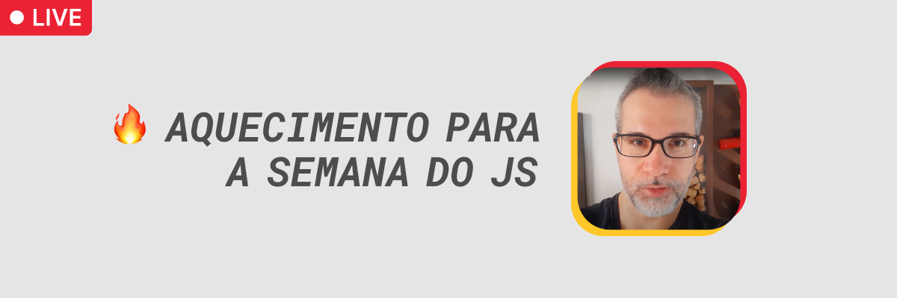

<h1 align="center">
  Exercícios do 🔥 Aquecimento para a Semana do JS
</h1>

<h6 align="center">Acompanhe as Lives de Aquecimento para Semana do JavaScript que acontecerão de 31 de julho à 13 de agosto, sempre às 20h.

Em cada live, eu vou mostrar técnicas para acelerar sua chegada na Fluência em JavaScript. Compareça para tirar suas dúvidas ao vivo =D</h6>

 

<h2 align="center">Link para a playlist do 🔥 Aquecimento para a Semana do JS</h2>

🔗 https://youtube.com/playlist?list=PLpSJMw6H4PFM3QOAzc_Gq7E6TXNyLJ31y

---

<h2 align="center">Como baixar este repositório</h2>

Para baixar este repositório em sua máquina, você pode clicar no botão verde "<> Code" (ali em cima) e fazer download do .zip. Caso você tenha noções de Git, você pode forkar o repositório ou cloná-lo.
 

---

<h2 align="center">Tem alguma dúvida ou sugestão?</h2>

Envie um email para 📨 <a href="mailto:oi@rogermelo.com.br">oi@rogermelo.com.br</a>

